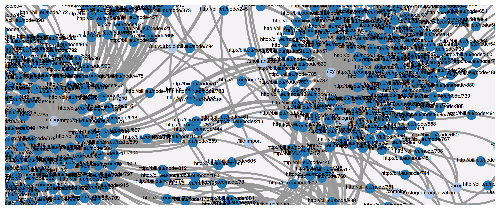
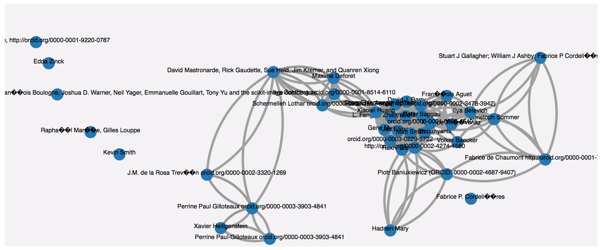
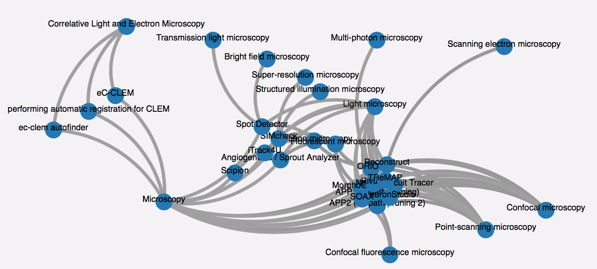
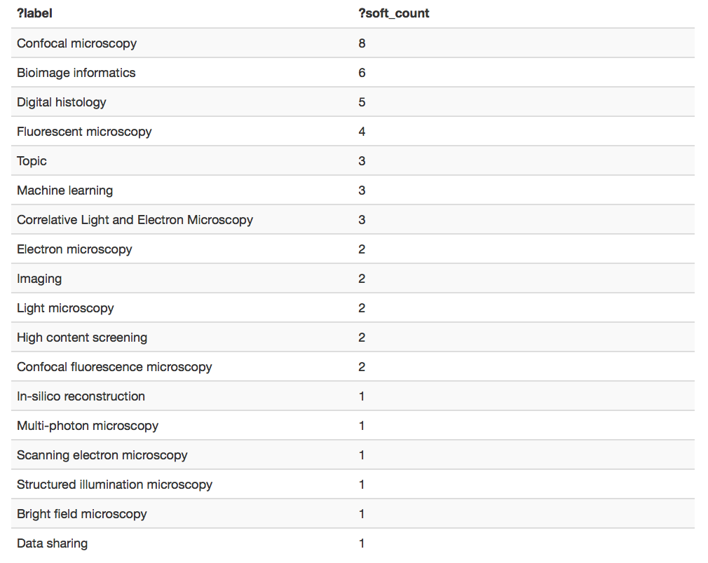

# Sample queries leveraging EDAM-Bioimaging and Bise Core ontologies
## Motivations
[Bise Core Ontology](http://www.essepuntato.it/lode/owlapi/https://raw.githubusercontent.com/NeuBIAS/neubias-data-model/master/owl-ontology/bise-core-ontology-v1.owl#d4e233) has been designed to model and better share the content of the [biii.eu](http://biii.eu) bioimaging ressources repository. [EDAM Bioimaging](https://bioportal.bioontology.org/ontologies/EDAM-BIOIMAGING) aims at capturing domain-specific knowledge related to bioimaging data analysis in terms of [topics](http://bioportal.bioontology.org/ontologies/EDAM-BIOIMAGING/?p=classes&conceptid=http%3A%2F%2Fedamontology.org%2Ftopic_0003) and [operations](http://bioportal.bioontology.org/ontologies/EDAM-BIOIMAGING/?p=classes&conceptid=http%3A%2F%2Fedamontology.org%2Foperation_0004) .
This web page briefly illustrates sample queries benefiting from knowledge captured in these two ontologies. Still, the RDF data dump is in a very preliminary stage and covers only few concepts and relations. 

## Q1
### Intention
Showing softwares and their dependencies. 
### How
```
CONSTRUCT {
    ?s1 <requires> ?d1
} WHERE {
    ?s1 a <http://biii.eu/node/software>
    ?s1 <http://bise-eu.info/core-ontology#requires> ?d1
}
```
### Results


## Q2
### Intention
Inferring software author communities based on shared interests (EDAM-Bioimaging Operations)
### How
we match pairs of softwares with their corresponding authors. As soon as the tools share the same EDAM operation, we make the assumption that authors share similar interets. FInally, we build a graph with edges `<share_same_interests_with>` between authors. 
```
CONSTRUCT {
    ?a1 <share_same_interests_with> ?a2
} where {
    ?s1 a <http://biii.eu/node/software>
    ?s1 <http://bise-eu.info/core-ontology#hasAuthor> ?a1
    ?s1 <http://bise-eu.info/core-ontology#hasFunction> ?f1

    ?s2 a <http://biii.eu/node/software>
    ?s2 <http://bise-eu.info/core-ontology#hasAuthor> ?a2
    ?s2 <http://bise-eu.info/core-ontology#hasFunction> ?f1
}
```
### Results


## Q3
### Intention
Search all available tools related to an EDAM topic. 
### How
We match an EDAM Topic which has a label which contains "microscopy". Then we search in the taxonomy all corresponding subclasses `?c rdfs:subClassOf* ?superClass`, and the softwares annotated with them. Finally, we display for each matched subgraph, an edge between a software label and a topic label.  

```
CONSTRUCT {
      ?ti <http://bise-eu.info/core-ontology#hasTopic> ?label .
} where {
    ?x a <http://biii.eu/node/software>
    ?x <http://bise-eu.info/core-ontology#hasAuthor> ?a
    ?x <http://dcterms/title> ?ti .
    ?x <http://bise-eu.info/core-ontology#hasTopic> ?c .

    ?c rdfs:subClassOf* ?superClass
    ?superClass rdfs:label ?label

 FILTER (?label ~ "microscopy")
}
```
### Results


## Q4
### Intention
Extract some metrics (sorted counts) based on EDAM terms. e.g. which topic is the most represented in biii.eu ?
### How

```
SELECT ?label (count(distinct ?s1) as ?soft_count) WHERE { 
       ?s1 a <http://biii.eu/node/software> 
       ?s1 <http://bise-eu.info/core-ontology#hasTopic> ?edam_class
        
        ?edam_class rdfs:label ?label
}
GROUP BY ?edam_class ?label
ORDER BY DESC(?soft_count)
```
### Results


